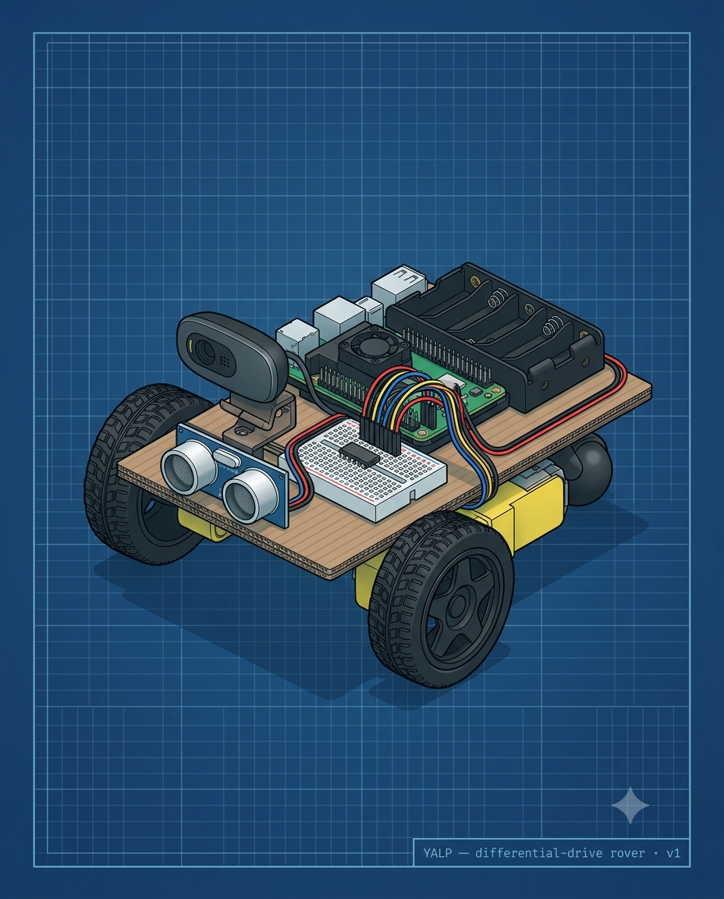
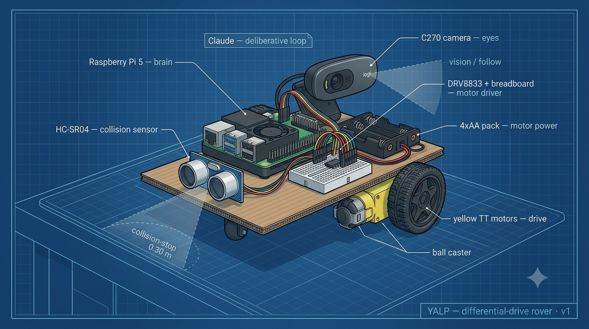

# yalp

**yalp** is a from-scratch hobby robot: a Raspberry Pi 5 brain, a USB camera, and
differential-drive wheels, driven by a two-loop design. A fast on-Pi **reactive**
layer (motors, ultrasonic, ~10–30 Hz, owns the camera) keeps the robot safe and
responsive; a slow cloud **deliberative** layer (Claude VLM/LLM) handles intent
and vision Q&A. Development is **laptop-first** — the whole brain is built and run
on a laptop against a *fake* reactive backend (your laptop webcam stands in for
the robot's camera); only the real reactive layer needs the Pi.



*Assembled yalp rover — blueprint illustration of the v1 cardboard chassis.*

## Repository layout

```
yalp/
├── README.md              # this file
├── SETUP.md               # step-by-step laptop bring-up for a non-coder owner
├── pyproject.toml         # packaging (src layout, console script `yalp`)
├── requirements.txt       # runtime deps (mirror of pyproject)
├── .env.example           # copy to .env; holds ANTHROPIC_API_KEY + model ids
├── src/yalp/
│   ├── config.py          # canonical constants (model tiers, thresholds, IPC)
│   ├── camera.py          # threaded latest-frame capture (webcam/image/synthetic)
│   ├── llm.py             # thin, mockable Anthropic wrapper
│   ├── cli.py             # `yalp` entrypoint + subcommand registry
│   ├── contract/          # loop-to-loop interface (Intent/RobotState) — Wave 2
│   ├── reactive/          # fast on-Pi loop + its fake — later wave
│   └── deliberative/      # perceive→think→act→report loop — later wave
├── scripts/               # dev/ops scripts
├── tests/                 # pytest suite + tests/assets/sample.jpg
└── docs/                  # the spec hub (open docs/index.html); source of truth
```

## Quickstart

```bash
# 1. Create and activate a virtual environment (Python 3.11+)
python3 -m venv .venv
source .venv/bin/activate

# 2. Install yalp in editable mode (with dev extras for pytest)
pip install -e ".[dev]"

# 3. Add your Anthropic API key
cp .env.example .env
# then edit .env and set ANTHROPIC_API_KEY=...

# 4. Sanity-check the install
yalp --help        # shows all available commands
pytest             # the full suite — 540 tests as of 2026-07 — runs hardware-free; all should pass
```

## Commands

All commands run **laptop-first** against the fake reactive backend (simulated
wheels); vision uses your real webcam, auto-falling back to a synthetic test
pattern when no camera is available.

| Command | What it does |
|---|---|
| `yalp --help` | Show the command set. |
| `yalp see [question...]` | Grab a camera still and ask Claude "what do you see?" (or any follow-up question). |
| `yalp agent [words... \| --command TEXT]` | Run the full deliberative loop (Claude → intents → fake reactive robot). |
| `yalp follow` | **FOLLOW mode**: detect/track the nearest person and steer the simulated wheels toward them. |

### `yalp see`

```
yalp see [question...]          # optional free-text question to ask about the frame
         [--image PATH]         # use a file instead of the webcam
         [--speak]              # read the answer aloud via macOS `say` (TTS)
```

### `yalp agent`

```
yalp agent [words...]           # natural-language command, e.g. yalp agent follow me
           [--command TEXT]     # explicit command string (alternative to positional words)
           [--steps N]          # max deliberate-loop iterations (default: 1)
           [--synthetic]        # use synthetic camera frames instead of webcam
           [--speak]            # read each response aloud (macOS `say` / Linux `espeak-ng`)
           [--listen]           # capture one spoken command via mic, transcribe, then run it
           [--preview/--no-preview]  # FOLLOW tail: live OpenCV window vs status lines
           [--follow-seconds N] # cap a FOLLOW tail at N seconds (default: until Ctrl-C)
           [--follow-detector {face,hog,person,auto}]  # follow detector (default: person)
           [--no-voice-stop]    # disable the hands-free "stop" listener during a voice FOLLOW
```

Positional words and `--command` always take precedence over `--listen`; combine
`--listen --speak` for a fully hands-free loop.

**"follow me" now stays and follows.** A command that ends in FOLLOW mode —
`yalp agent "follow me"` (typed) or `yalp agent --listen` (spoken) — no longer
exits a heartbeat after the handoff. The agent opens a **live preview window** and
**follows you until Ctrl-C** (the same real-camera + simulated-wheels loop as
`yalp follow`, reusing the backend already running). `q`/Esc in the window or
`--follow-seconds N` also stops it.

- **Say "stop" to end a voice follow (hands-free).** When following was started
  by VOICE (`yalp agent --listen`), a background mic listener runs alongside the
  follow loop: say **"stop"** (or **"halt"**) and FOLLOW ends — roughly a 2-3s
  lag for the spoken window to be captured and transcribed. It's best-effort and
  never falsely stops (a failed/empty transcription is ignored) and never
  crashes (no voice deps → it quietly no-ops). `--no-voice-stop` disables the
  listener; **Ctrl-C** and **`q`/Esc** (in a preview window) remain instant
  stops either way. The listener is only started on the `--listen` path (a typed
  `yalp agent "follow me"` has no mic listener — use Ctrl-C / `q`).
- `--preview` / `--no-preview` force the preview window on/off. The default is
  AUTO: preview ON when stdout is a TTY **and** a cv2 GUI is available, OFF
  otherwise.
- **"follow me" defaults to the room-range `person` detector.** Unlike `yalp
  follow` (desk-only `face` default), the agent/voice path assumes the user is
  standing across the room, so it pre-builds the orientation-agnostic cv2.dnn
  MobileNet-SSD body detector — follow keeps tracking from any angle as you walk
  away. Override with `--follow-detector {face,hog,person,auto}`; the
  `YALP_FOLLOW_DETECTOR` environment variable is also honored (the flag wins). If
  the chosen detector/model is unavailable it falls back gracefully (never
  crashes).
- **Headless / Raspberry Pi:** with no display, the FOLLOW tail prints readable
  `FollowReporter` status lines instead of opening a window — no GUI required,
  and Ctrl-C exits cleanly. cv2 is imported lazily so headless runs are
  unaffected.

Positional words and `--command` always take precedence over `--listen`; combine
`--listen --speak` for a fully hands-free loop.

### `yalp follow`

```
yalp follow [--detector {face,hog,person,auto}]
            [--preview]         # OpenCV overlay window (headless-safe)
            [--benchmark]       # print fps baseline vs Gate H threshold
            [--seconds N]       # auto-stop after N seconds
            [--hz HZ]           # target tick rate (default: config.FOLLOW_HZ)
            [--synthetic]       # no-camera demo with generated frames
```

FOLLOW mode (software-spec.md §4): detect/track the nearest person on the webcam
and steer the simulated wheels toward them (turn to center, drive forward until
close; clean stop when lost/stale or too dark).

`--detector` picks the person detector:

- `face` (**default**, desk-only) — OpenCV's bundled Haar face cascade; reliable at
  desk range where the webcam frames only your head + shoulders.
- `hog` — OpenCV's built-in standing-body detector (no model download).
- `person` — **ORIENTATION-AGNOSTIC** cv2.dnn MobileNet-SSD body detector: tracks a
  person from **any angle** (front, **back**, side) at room range, so follow keeps
  working when you walk **away** with your back turned. This is the **robot's**
  default (face is desk-only) and the **Gate H** detector candidate. It uses
  OpenCV's built-in `cv2.dnn` (**no new pip dependency**) and downloads a small
  model file once on first run, cached under `~/.cache/yalp/models` (override with
  `YALP_MODEL_CACHE_DIR`); offline it fails with clear instructions for dropping the
  file in by hand. Try it: `yalp follow --detector person`, then stand back and turn
  around — it should still track.
- `auto` — prefers `person` at range, falls back to `face` for close-ups.

Benchmark the Gate H candidate with `yalp follow --benchmark --detector person`. The
laptop fps is a **ceiling**, not the gate verdict — Gate H is measured on the Pi
(under concurrent load) later.

### Voice output (TTS)

`yalp see --speak` and `yalp agent --speak` read the reply aloud after every turn.
Any command that produces a text response supports `--speak`; the backend is
chosen by platform:

| Platform | Backend | Install |
|---|---|---|
| macOS | built-in `say` | nothing — ships with the OS |
| Linux / Raspberry Pi | `espeak-ng` | `sudo apt-get install espeak-ng` |
| macOS (parity with Pi) | `espeak-ng` | `brew install espeak-ng` |

When no TTS binary is present, `--speak` is a silent no-op — nothing crashes and
the text reply still prints.

### Voice input (push-to-talk STT)

`yalp agent --listen` records one spoken command (~5 s by default), transcribes it
locally with [faster-whisper](https://github.com/SYSTRAN/faster-whisper), and runs
it through the agent exactly as if you had typed it. Nothing is sent off the
machine.

```bash
yalp agent --listen              # speak a command, run it
yalp agent --listen --speak      # speak a command, hear the reply
```

**Optional install** — voice input requires extra dependencies not included in the
base install (or the tests):

```bash
pip install -e ".[voice]"        # adds sounddevice (mic) + faster-whisper (STT)
```

Linux / Raspberry Pi also need the PortAudio system library:

```bash
sudo apt-get install libportaudio2
```

**STT model** — the default is `tiny` (fastest, lowest RAM). Override with
`YALP_STT_MODEL=base` for better accuracy. On a 4 GB Raspberry Pi 5 keep the
model at `tiny`.

**"follow me" not heard?** The CLI now reports the captured mic level on an empty
result. A **very low peak** (e.g. `>>> [heard nothing — mic input very low (peak
0.002)…]`) means your OS input device/level is the problem, not Yalp — pick the
right device and turn up the input in System Settings ▸ Sound ▸ Input. If the peak
looks healthy but no words were recognized, give yourself more time with
`YALP_VOICE_RECORD_SECONDS=7` or more accuracy with `YALP_STT_MODEL=base`.

**Precedence** — positional words and `--command` always win over `--listen`, so
typed commands are never overridden accidentally.

**Dev / CI without hardware** — mirror the synthetic-camera story for voice:

```bash
# No microphone — use a pre-recorded WAV file
YALP_VOICE_SOURCE=file YALP_VOICE_AUDIO_FILE=tests/assets/sample.wav yalp agent --listen

# No microphone at all — synthetic audio source (silence)
YALP_VOICE_SOURCE=synthetic yalp agent --listen

# No model download — fake STT backend returns a fixed transcript
YALP_STT_BACKEND=fake yalp agent --listen
```

The test suite uses `YALP_STT_BACKEND=fake` and the file/synthetic sources so it
runs with **no mic, no model download, and no network**.

### Voice env vars

All voice knobs live in `.env` (see `.env.example` to override):

| Variable | Default | Purpose |
|---|---|---|
| `YALP_VOICE_SOURCE` | `microphone` | Audio source: `microphone`, `synthetic`, or `file` |
| `YALP_VOICE_SAMPLE_RATE` | `16000` | Audio sample rate (Hz) |
| `YALP_VOICE_CHANNELS` | `1` | Audio channels (1 = mono) |
| `YALP_VOICE_RECORD_SECONDS` | `5` | How long push-to-talk records |
| `YALP_VOICE_AUDIO_FILE` | _(none)_ | WAV file path when `YALP_VOICE_SOURCE=file` |
| `YALP_STT_BACKEND` | `faster-whisper` | STT engine: `faster-whisper` or `fake` |
| `YALP_STT_MODEL` | `tiny` | faster-whisper model size (`tiny`/`base`) |

Full technical reference: [docs/technical/audio.md](docs/technical/audio.md).

## What's implemented / What's next



*Annotated build overview — labels the deliberative-loop (cloud), the vision/follow reactive layer, and the 0.30 m collision-stop threshold.*

**The laptop "brain" is COMPLETE** — the full voice → follow → voice-stop loop runs
end to end on the laptop ("real eyes, fake wheels"), and **the full suite — 540 tests as of 2026-07 — runs hardware-free**:

- `yalp see` — single-frame vision: webcam → Claude → spoken/typed scene description.
- `yalp agent` — deliberative loop (Claude) driving abilities against the reactive
  layer (simulated motors on the laptop).
- `yalp follow` — standalone reactive person-tracker (live camera).
- **Voice OUTPUT** — cross-platform TTS via `--speak` (macOS `say`, Linux/Pi `espeak-ng`).
- **Voice INPUT** — push-to-talk `yalp agent --listen`: records a ~5 s window, transcribes
  locally with faster-whisper (default `tiny`), and runs the transcript as a command.
- **Voice-driven FOLLOW** — saying "follow me" brings up the camera and follows live
  (room-range `person` detector by default), staying in follow until you say
  "stop"/"halt" (hands-free) or press Ctrl-C / `q`.
- All laptop-first and fully testable with synthetic/fake audio and a synthetic camera —
  no hardware required. Optional voice deps: `pip install -e ".[voice]"`; see
  [docs/technical/audio.md](docs/technical/audio.md).

**Honest caveats:** `RealReactiveBackend` (real GPIO motors + HC-SR04) is **fully implemented and laptop-tested** — the tick loop, collision-stop, motor drive paths, and `MotorWatchdog` are all wired in; what remains is connecting the physical motors and confirming behavior on real hardware (motors not yet wired). On macOS a cosmetic objc "libavdevice
implemented in both cv2 and av" warning may print (transcription unaffected). Interaction
is fixed-duration push-to-talk; voice-activity-detection and a "hey Yalp" wake-word are
future upgrades.

**Next target — Raspberry Pi 5 bring-up.** Move the proven brain onto the Pi 5 hardware.
What can proceed **now (no battery pack needed)**: flash Raspberry Pi OS Lite 64-bit
(headless, SSH, Wi-Fi); install Python 3.11+ + gpiozero/lgpio; GPIO first-light / LED
blink (milestone G); build & bench-check the HC-SR04 1k/2k voltage divider to ~3.3 V
(milestone I); wire the drivetrain + sensor with power off (§5) — no soldering needed.
What **waits on the inbound 4×AA NiMH battery holder**: Gate E (power/brownout, F),
"hello motors" (H), collision-stop reflex (J), and the detector-fps gates (K/L) — i.e.
anything where motors actually spin. Then: wire the motors physically and run on-hardware validation — `RealReactiveBackend` is already fully implemented (tick loop, collision-stop safety override, motor translation, `MotorWatchdog` integration) and laptop-tested; it is awaiting on-hardware confirmation because motors are not yet physically wired. See
[docs/technical/roadmap.md](docs/technical/roadmap.md) for the gate ladder and
[docs/technical/hardware-runbook.md](docs/technical/hardware-runbook.md) for bring-up steps.

## Viewing the spec hub

The full design — product vision, architecture, software/hardware specs, and the
build roadmap — is a single self-contained page. Open it in a browser:

```
docs/index.html
```

After editing any markdown doc under `docs/`, rebuild the embedded page with
`python3 docs/build.py`.

## Learn more

- **Setup:** [SETUP.md](SETUP.md) — laptop bring-up, getting an API key, running tests.
- **Build order & gates:** [docs/technical/roadmap.md](docs/technical/roadmap.md).
- **The loop contract:** [docs/technical/software-spec.md](docs/technical/software-spec.md).
- **Voice stack (TTS + STT):** [docs/technical/audio.md](docs/technical/audio.md).
